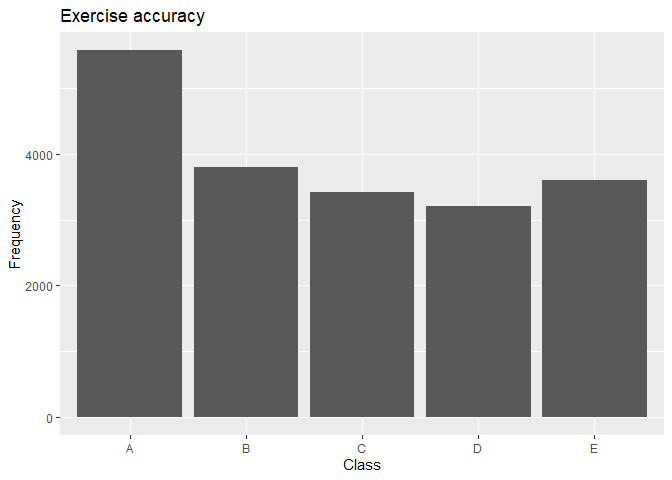
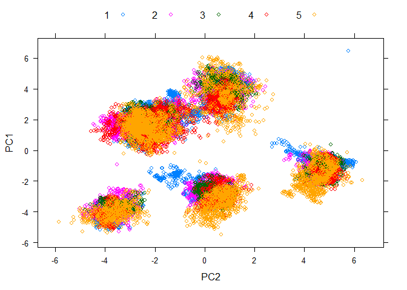
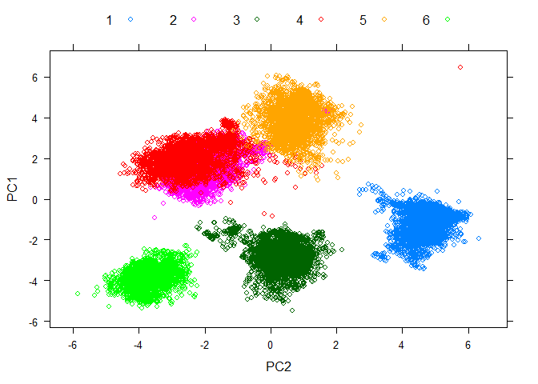
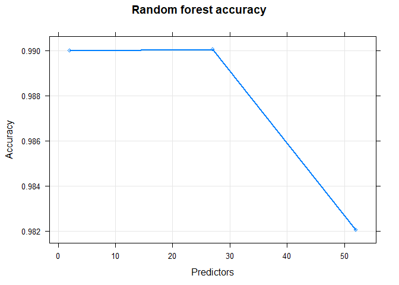
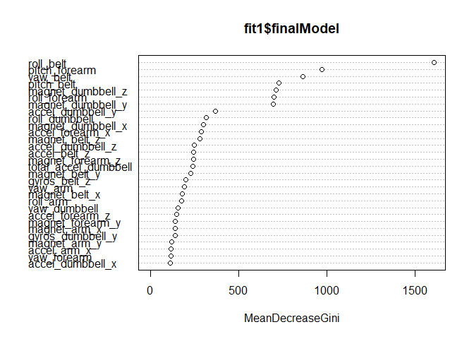
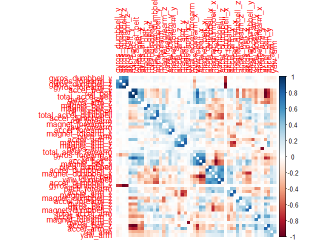

# Wearables activity prediciton


## Business Question

#### What are we trying to predict?

The classe variable which consists of 5 categories defining how well the exercises were carried out by 6 participants. We have a number of sensor measurements that can be used to predict this variable.

#### What type of problem is it?

This is a multivariate prediction problem in which we have to build a model. Describe how you built your model, how you used cross validation, what you think the expected out of sample error is, and why you made the choices you did. You will also use your prediction model to predict 20 different test cases.

#### What type of data do we have? 
The data is in csv format. It presents a header row with the column names. The predictor variable is categorical.


## Read the files


```r
training <- read.csv("../pml-training.csv", header = TRUE, na.strings = c("NA", "", "#DIV/0!"))
testing  <- read.csv("../pml-testing.csv", header = TRUE, na.strings = c("NA", "", "#DIV/0!"))

dim(training); dim(testing)
```

```
## [1] 19622   160
```

```
## [1]  20 160
```
I cleaned up the missing values, NAs and #DIV/0! while loading the files. There are a lot of missing values 19,000+, so imputation is not possible. 

##Exploratory data analysis

### Lets study the response variable
The response variable is classe. According to the text,
*Six young health participants were asked to perform one set of 10 repetitions of the Unilateral Dumbbell Biceps Curl in five different fashions: exactly according to the specification (Class A), throwing the elbows to the front (Class B), lifting the dumbbell only halfway (Class C), lowering the dumbbell only halfway (Class D) and throwing the hips to the front (Class E).

Read more: http://groupware.les.inf.puc-rio.br/har#ixzz5vuWJGhXP*


```r
qplot(training$classe, ylab = "Frequency" , xlab = "Class", main = "Exercise accuracy")
```

<!-- -->
Class A which is the exercise done correctly is the most frequent. 

### Understanding the variables 

The publication mentioned on the website has details about the features.

- Euler angles (roll, pitch and yaw)
- For Euler angles of each of 4 sensor, eight features calculated: mean, variance, standard deviation, max, min, amplitude, kurtosis and skewness (96 features)
-  raw accelerometer, gyroscope and magnetometer readings, for each sensor (12 features)
- 6 users


```r
descr <- dlookr::describe(training)
```

```
## Registered S3 method overwritten by 'xts':
##   method     from
##   as.zoo.xts zoo
```

```
## Registered S3 method overwritten by 'quantmod':
##   method            from
##   as.zoo.data.frame zoo
```

```
## Registered S3 methods overwritten by 'car':
##   method                          from
##   influence.merMod                lme4
##   cooks.distance.influence.merMod lme4
##   dfbeta.influence.merMod         lme4
##   dfbetas.influence.merMod        lme4
```

```r
descr[which(descr$skewness > 10), ]
```

```
## # A tibble: 16 x 26
##    variable     n    na     mean      sd se_mean     IQR skewness kurtosis
##    <chr>    <dbl> <dbl>    <dbl>   <dbl>   <dbl>   <dbl>    <dbl>    <dbl>
##  1 amplitu~   406 19216   3.77   2.53e+1 1.25e+0   1.78      13.9     195.
##  2 stddev_~   406 19216   1.34   1.03e+1 5.11e-1   0.6       15.1     238.
##  3 var_yaw~   406 19216 107.     1.66e+3 8.22e+1   0.465     17.3     315.
##  4 var_rol~   406 19216 417.     2.01e+3 9.96e+1 221.        10.9     134.
##  5 kurtosi~   401 19221   0.452  3.19e+0 1.59e-1   1.62      12.8     215.
##  6 kurtosi~   404 19218   0.286  3.30e+0 1.64e-1   1.30      12.5     200.
##  7 max_yaw~   401 19221   0.450  3.19e+0 1.59e-1   1.6       12.8     215.
##  8 min_yaw~   401 19221   0.450  3.19e+0 1.59e-1   1.6       12.8     215.
##  9 var_acc~   406 19216   4.39   1.35e+1 6.70e-1   3.06      12.2     195.
## 10 gyros_d~ 19622     0   0.0461 6.10e-1 4.35e-3   0.35      31.7    2682.
## 11 gyros_d~ 19622     0  -0.129  2.29e+0 1.63e-2   0.34     136.    18859.
## 12 kurtosi~   322 19300  -0.689  2.51e+0 1.40e-1   0.781     13.6     217.
## 13 max_yaw~   322 19300  -0.689  2.52e+0 1.40e-1   0.80      13.6     217.
## 14 min_yaw~   322 19300  -0.689  2.52e+0 1.40e-1   0.80      13.6     217.
## 15 gyros_f~ 19622     0   0.0752 3.10e+0 2.21e-2   3.08      51.3    5152.
## 16 gyros_f~ 19622     0   0.151  1.75e+0 1.25e-2   0.67     116.    15277.
## # ... with 17 more variables: p00 <dbl>, p01 <dbl>, p05 <dbl>, p10 <dbl>,
## #   p20 <dbl>, p25 <dbl>, p30 <dbl>, p40 <dbl>, p50 <dbl>, p60 <dbl>,
## #   p70 <dbl>, p75 <dbl>, p80 <dbl>, p90 <dbl>, p95 <dbl>, p99 <dbl>,
## #   p100 <dbl>
```

- Many of the variables have lots of NAs. For exampe, kurtosis_yaw_belt does not have any significant values. 
- The #DIV/0! are probably computation errors. Also, the variables where DIV/0 occur do not have other values and hence imputation is not possible.
- Readings for each of the individuals were taken only at a certain timepoint. The raw time point part2 is uniformly distributed, while part 1 only has specific timepoints.
- Some of the variables have high skewness & kurtosis
- Time of doing exercise and user names should not be important to make a prediction for the exercise and hence can be removed.

### Feature Selection & preprocessing

Remove columns with NAs, and the users, timestamps which are not important.


```r
trainproc <- training[colSums(!is.na(training)) > 0]
trainproc <- trainproc[ ,-c(1:7)]
```


```r
trainproc <- trainproc[sapply(trainproc, function(x) !any(is.na(x)))]
dim(trainproc)
```

```
## [1] 19622    53
```

PCA with selected features

```r
typeColor <- as.numeric(trainproc$classe)
preProc <- preProcess(trainproc[,-53],method="pca",pcaComp=10)
trainPC <- predict(preProc, trainproc[,-53])

xyplot(PC1 ~ PC2, data = trainPC, groups =  typeColor, auto.key = list(columns = 5)) #Colored by classe
```

<!-- -->

```r
xyplot(PC1 ~ PC2, data = trainPC, groups =  as.numeric(training$user_name),auto.key = list(columns = 6)) #Colored by user name
```

<!-- -->

The data seems to clearly cluster according to the different users. However, there also seems to be some clustering according to the classe variable. These patterns can be picked up using various training methods.

## Modeling

### Validation set
Creating a validation set to test out of sample error once I find suitable models.

```r
inTrain <- createDataPartition(trainproc$classe, p = 0.8, list = FALSE)

trainNum <- trainproc[inTrain,]
validation <- trainproc[-inTrain,]
dim(trainNum);dim(validation)
```

```
## [1] 15699    53
```

```
## [1] 3923   53
```

### Training on various predictors
#### Random Forest

```r
set.seed(123)
registerDoParallel(4) 
getDoParWorkers()
```

```
## [1] 4
```

```r
my_control <- trainControl(method = "cv", # for "cross-validation"
                           number = 3, # number of k-folds
                           savePredictions = "final",
                           allowParallel = TRUE)

fit1 <- train(classe ~ ., 
              data = trainNum,
              method = c("rf"),
              trControl = my_control,
              )

fit1
```

```
## Random Forest 
## 
## 15699 samples
##    52 predictor
##     5 classes: 'A', 'B', 'C', 'D', 'E' 
## 
## No pre-processing
## Resampling: Cross-Validated (3 fold) 
## Summary of sample sizes: 10468, 10465, 10465 
## Resampling results across tuning parameters:
## 
##   mtry  Accuracy   Kappa    
##    2    0.9899993  0.9873479
##   27    0.9900634  0.9874292
##   52    0.9820370  0.9772751
## 
## Accuracy was used to select the optimal model using the largest value.
## The final value used for the model was mtry = 27.
```
The in-sample accuracy for random forest is 0.988. 


```r
fit1$finalModel
```

```
## 
## Call:
##  randomForest(x = x, y = y, mtry = param$mtry) 
##                Type of random forest: classification
##                      Number of trees: 500
## No. of variables tried at each split: 27
## 
##         OOB estimate of  error rate: 0.64%
## Confusion matrix:
##      A    B    C    D    E class.error
## A 4458    3    2    0    1 0.001344086
## B   24 3010    4    0    0 0.009216590
## C    0   15 2711   12    0 0.009861213
## D    0    0   26 2543    4 0.011659541
## E    0    0    4    6 2876 0.003465003
```

In-sample error rate is 1.2% (1-accuracy). OOB estimate of  error rate is 0.57%

Plot of random forest accuracy with predictors.

```r
plot(fit1, log = "y", lwd = 2, main = "Random forest accuracy", xlab = "Predictors", 
    ylab = "Accuracy")
```

<!-- -->

Variable importance in the randomforest model

```r
randomForest::varImpPlot(fit1$finalModel)
```

<!-- -->

#### Linear Discriminant analysis

```r
fit2 <- train(classe ~ ., 
              data = trainNum,
              method = c("lda"),
              trControl = my_control,
              )

fit2
```

```
## Linear Discriminant Analysis 
## 
## 15699 samples
##    52 predictor
##     5 classes: 'A', 'B', 'C', 'D', 'E' 
## 
## No pre-processing
## Resampling: Cross-Validated (3 fold) 
## Summary of sample sizes: 10466, 10465, 10467 
## Resampling results:
## 
##   Accuracy   Kappa    
##   0.6986423  0.6187306
```

Accuracy for LDA is much lower at 70.5%. In-sample error rate is 29.5%.

#### XG Boost Tree

```r
set.seed(123)
registerDoParallel(4) 
getDoParWorkers()
```

```
## [1] 4
```

```r
fit3 <- train(classe ~ ., 
              data = trainNum,
              method = c("xgbTree"),
              trControl = my_control,
              )
max(fit3$results$Accuracy)
```

```
## [1] 0.9928659
```

Both random forest and xgbtree give an accuracy of ~0.99 on the training set. Let's see how they perform on the validation set.


```r
mat <- xgboost::xgb.importance(feature_names = colnames(trainNum),model = fit3$finalModel)
xgboost::xgb.plot.importance (importance_matrix = mat[1:20]) 
```

<!-- -->


### Out-of-sample accuracy & error

```r
valpred1 <- predict(fit1, newdata = validation)
valpred2 <- predict(fit2, newdata = validation)
valpred3 <- predict(fit3, newdata = validation)

confusionMatrix(valpred1, validation$classe)
```

```
## Confusion Matrix and Statistics
## 
##           Reference
## Prediction    A    B    C    D    E
##          A 1116    3    0    0    0
##          B    0  754    3    0    1
##          C    0    2  680    6    0
##          D    0    0    1  637    1
##          E    0    0    0    0  719
## 
## Overall Statistics
##                                           
##                Accuracy : 0.9957          
##                  95% CI : (0.9931, 0.9975)
##     No Information Rate : 0.2845          
##     P-Value [Acc > NIR] : < 2.2e-16       
##                                           
##                   Kappa : 0.9945          
##                                           
##  Mcnemar's Test P-Value : NA              
## 
## Statistics by Class:
## 
##                      Class: A Class: B Class: C Class: D Class: E
## Sensitivity            1.0000   0.9934   0.9942   0.9907   0.9972
## Specificity            0.9989   0.9987   0.9975   0.9994   1.0000
## Pos Pred Value         0.9973   0.9947   0.9884   0.9969   1.0000
## Neg Pred Value         1.0000   0.9984   0.9988   0.9982   0.9994
## Prevalence             0.2845   0.1935   0.1744   0.1639   0.1838
## Detection Rate         0.2845   0.1922   0.1733   0.1624   0.1833
## Detection Prevalence   0.2852   0.1932   0.1754   0.1629   0.1833
## Balanced Accuracy      0.9995   0.9961   0.9958   0.9950   0.9986
```

```r
#confusionMatrix(valpred2, validation$classe)
confusionMatrix(valpred3, validation$classe)
```

```
## Confusion Matrix and Statistics
## 
##           Reference
## Prediction    A    B    C    D    E
##          A 1116    3    0    0    0
##          B    0  756    2    0    0
##          C    0    0  681    9    0
##          D    0    0    1  634    3
##          E    0    0    0    0  718
## 
## Overall Statistics
##                                           
##                Accuracy : 0.9954          
##                  95% CI : (0.9928, 0.9973)
##     No Information Rate : 0.2845          
##     P-Value [Acc > NIR] : < 2.2e-16       
##                                           
##                   Kappa : 0.9942          
##                                           
##  Mcnemar's Test P-Value : NA              
## 
## Statistics by Class:
## 
##                      Class: A Class: B Class: C Class: D Class: E
## Sensitivity            1.0000   0.9960   0.9956   0.9860   0.9958
## Specificity            0.9989   0.9994   0.9972   0.9988   1.0000
## Pos Pred Value         0.9973   0.9974   0.9870   0.9937   1.0000
## Neg Pred Value         1.0000   0.9991   0.9991   0.9973   0.9991
## Prevalence             0.2845   0.1935   0.1744   0.1639   0.1838
## Detection Rate         0.2845   0.1927   0.1736   0.1616   0.1830
## Detection Prevalence   0.2852   0.1932   0.1759   0.1626   0.1830
## Balanced Accuracy      0.9995   0.9977   0.9964   0.9924   0.9979
```

xgbtree has the best prediction accuracy on the validation dataset of 0.996, as well as better per-class  statistics. Random forest is a close second.

#### Expected Out-of sample error in percent

```r
accuracy.rf <- sum(valpred1 == validation$classe)/length(valpred1)
accuracy.xgb <- sum(valpred3 == validation$classe)/length(valpred3)

out.sample.error.rf <- (1 - accuracy.rf)*100
out.sample.error.xgb <- (1 - accuracy.xgb)*100

print(out.sample.error.rf , digits = 3)
```

```
## [1] 0.433
```

```r
print(out.sample.error.xgb , digits = 3)
```

```
## [1] 0.459
```


## Test set prediction

```r
test.xgb <- predict(fit3, newdata = testing)

test.xgb
```

```
##  [1] B A B A A E D B A A B C B A E E A B B B
## Levels: A B C D E
```


#Conclusion

The dataset had a number of features alongwith the categorical response variable classe. The features with NA values were removed alongwith features like user and time which should not have an impact on our response variable. PCA with these features show that the classe variables segregate according to these features. It was interesting to note that there was clear segregation based on the users (even though users were not included as a feature). This indicates that characteristics of usage by different users could be detected by the sensors.

Random forest, XGBTree and LDA models were trained on the data using default parameters and 3-fold cross-validation. RF & XGBtree had the best performance with ~99% accuracy. The out-of-sample error rate estimated on the validation data was 0.54% and 0.43% for xgbtree & Rf respectively.

Prediction on the test set was done using XGB tree model.
